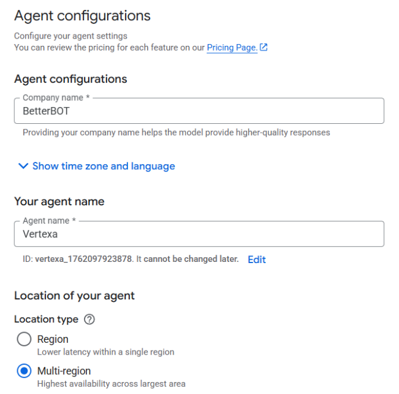
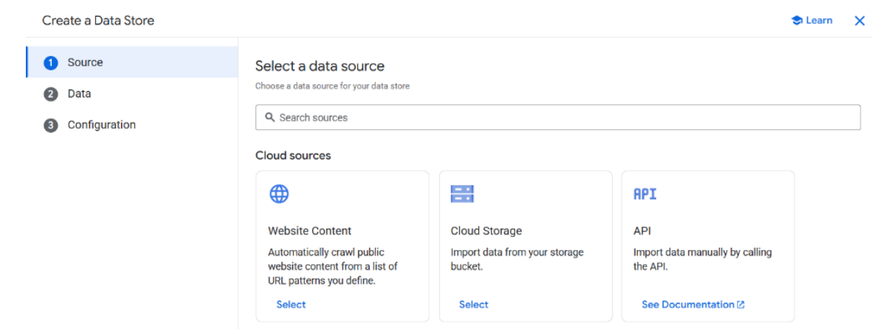
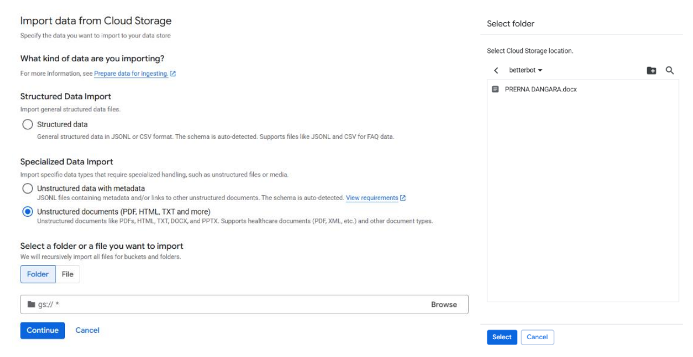
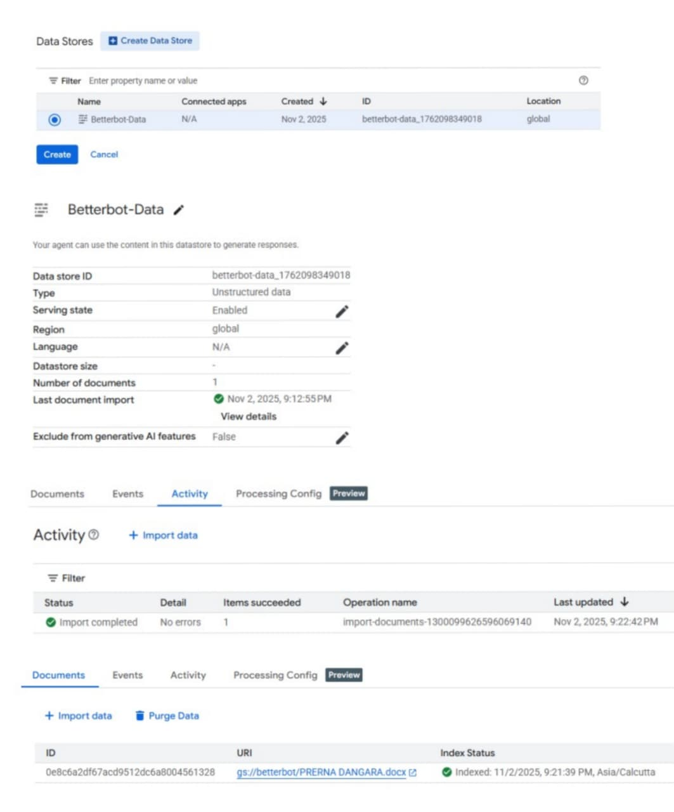
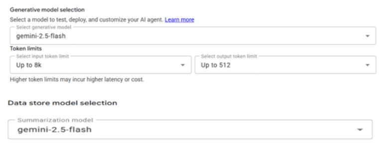
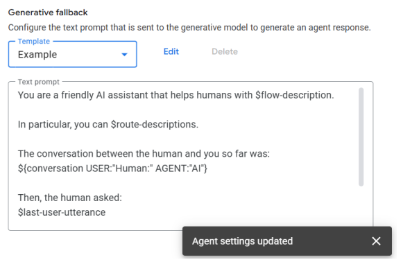
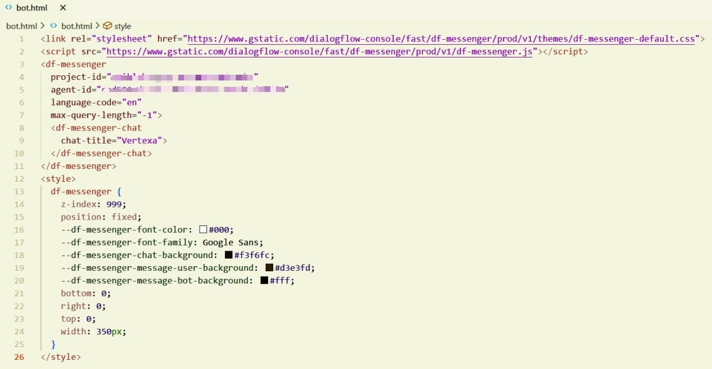
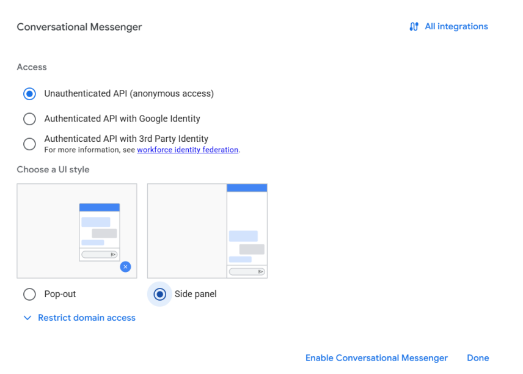
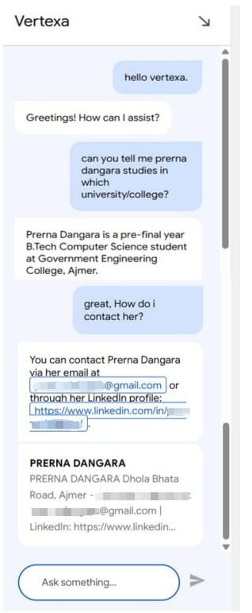

<div align="center">

  
  
  
  

  <h1>🤖 Vertexa — Customised LLM Chatbot</h1>

  <p>
    A domain-specific conversational AI chatbot built using Google Cloud Vertex AI Agent Builder,
    Dialogflow CX, Datastore and Gemini.
  </p>

</div>

---

## Table of Contents

- [Overview](#overview)
- [System Architecture](#system-architecture)
- [Key Features](#key-features)
- [Technologies Used](#technologies-used)
- [How It Works](#how-it-works)
- [Implementation](#implementation)
- [Testing & Results](#testing--results)
- [Screenshots](#screenshots)
- [Project Documentation](#project-documentation)
- [Limitations](#limitations)
- [Future Scope](#future-scope)

---

## Overview

**Vertexa** is a customised Large Language Model (LLM) chatbot developed using **Google Cloud's Vertex AI Agent Builder**.

The project demonstrates how a conversational AI system can combine a custom knowledge base with generative AI to provide domain-specific and natural-language responses.

Unlike traditional rule-based chatbots that depend entirely on predefined responses, Vertexa combines:

- Custom document-based knowledge
- Datastore-based information retrieval
- Dialogflow CX conversation management
- Gemini-powered generative responses
- Generative fallback for queries that do not match predefined intents

The project was developed as a practical demonstration of **Generative AI, Large Language Models and Google Cloud technologies**.

---

## System Architecture

```text
                         ┌─────────────────────┐
                         │        User         │
                         └──────────┬──────────┘
                                    │
                                    ▼
                         ┌─────────────────────┐
                         │   Vertexa Chat UI   │
                         └──────────┬──────────┘
                                    │
                                    ▼
                         ┌─────────────────────┐
                         │ Vertex AI Agent     │
                         │      Builder        │
                         └───────┬───────┬─────┘
                                 │       │
                    ┌────────────┘       └────────────┐
                    ▼                                 ▼
          ┌──────────────────┐              ┌──────────────────┐
          │     Datastore    │              │   Dialogflow CX  │
          │  Custom Data     │              │ Intents & Flows  │
          └────────┬─────────┘              └────────┬─────────┘
                   │                                  │
                   └──────────────┬───────────────────┘
                                  ▼
                       ┌─────────────────────┐
                       │   Gemini 2.5 Flash  │
                       │ Generative Response │
                       └──────────┬──────────┘
                                  │
                                  ▼
                       ┌─────────────────────┐
                       │   Final Response    │
                       └─────────────────────┘
```

---

## Key Features

- **Domain-Specific Question Answering**  
  Provides responses based on information available in the connected custom datastore.

- **Custom Knowledge Base**  
  Uses documents stored through Google Cloud Storage and connected to the Agent Builder datastore.

- **Generative AI Responses**  
  Uses Gemini to generate natural-language responses.

- **Dialogflow CX Integration**  
  Supports intents, conversation flows and structured conversational management.

- **Generative Fallback**  
  Allows the chatbot to respond to queries that do not match predefined intents.

- **Multi-Turn Conversations**  
  Supports conversational interactions where context can be maintained across turns.

- **Web-Based Chat Interface**  
  Deployed using the Conversational Messenger interface.

- **Cloud-Based Architecture**  
  Built using managed Google Cloud services rather than requiring a locally hosted model.

---

## Technologies Used

| Technology | Purpose |
|---|---|
| **Google Cloud Platform** | Cloud infrastructure and AI services |
| **Vertex AI Agent Builder** | Building and managing the conversational agent |
| **Gemini 2.5 Flash** | Generative AI response generation |
| **Dialogflow CX** | Intents, conversation flows and fallback handling |
| **Cloud Storage** | Storage of source documents |
| **Datastore** | Custom knowledge base and document retrieval |
| **Conversational Messenger** | Web-based chatbot interface |
| **Google Chrome** | Development and testing environment |

---

## How It Works

1. **User Query**  
   The user enters a question through the Vertexa chatbot interface.

2. **Request Processing**  
   The request is received by the Vertex AI Agent Builder application.

3. **Knowledge Retrieval**  
   For domain-specific questions, relevant information is retrieved from the connected Datastore.

4. **Conversational Management**  
   Dialogflow CX manages predefined intents and conversation flows.

5. **Generative Response**  
   Gemini generates natural-language responses based on the available context.

6. **Generative Fallback**  
   When a query does not match an appropriate predefined intent, the configured generative fallback allows the LLM to handle the request.

7. **Response Delivery**  
   The final response is displayed to the user through the chatbot interface.

---

## Implementation

The project was implemented through the following stages.

### 1. Vertex AI Agent Builder Setup

The required Google Cloud environment and AI services were configured to create the chatbot application.

### 2. Creating the Vertexa Chat Application

A conversational chat application was created using Vertex AI Agent Builder.

The chatbot was configured with:

- **Company Name:** BetterBOT
- **Agent Name:** Vertexa

### 3. Cloud Storage

A Cloud Storage bucket was created to store the source document used as the chatbot's knowledge source.

### 4. Building the Datastore

A datastore was created and connected to the Cloud Storage source.

The uploaded document was processed and indexed so that relevant information could be retrieved during conversations.

### 5. Connecting the Datastore

The datastore was connected to the Vertexa application, allowing the chatbot to use the imported information as its custom knowledge source.

### 6. Dialogflow CX Configuration

Dialogflow CX was configured to manage conversational behavior through intents and conversation flows.

Example intents included:

- Greetings
- College Information
- Contact Details

### 7. Gemini Configuration

**Gemini 2.5 Flash** was selected as the generative model.

Generative fallback was enabled so that queries without matching predefined intents could be handled using generative AI.

### 8. Testing

The chatbot was tested using different types of queries, including:

- Intent-based queries
- Domain-specific questions
- General questions
- Unknown queries
- Multi-turn conversations
- Edge cases

### 9. Deployment

The chatbot was configured using Conversational Messenger and deployed through a web-based interface.

---

## Testing & Results

The chatbot was evaluated based on:

- Response accuracy
- Relevance to the custom datastore
- Natural-language quality
- Generative fallback behavior
- Multi-turn conversation handling
- Handling of irrelevant queries

### Test Cases

| Test Case | Example | Result |
|---|---|---|
| Greeting Intent | "Hello" | Accurate |
| Data Query | Domain-specific question | Accurate |
| Unknown Query | "Tell me a joke" | Generative response |
| Multi-Turn Query | Follow-up question | Context maintained |
| Edge Case | Random input | Handled gracefully |

### Observed Results

According to the project testing documented in the report:

- **Average response time:** approximately 1.5–2.2 seconds
- **Domain-data accuracy:** approximately 92%
- **Generative quality:** High coherence and contextual understanding
- **Error handling:** Effective fallback mechanism

These results were observed during the project's testing phase using the Vertex AI Agent Builder and Dialogflow CX environments.

---

## Screenshots

### Creating the Vertexa Chat Application



### Selecting Cloud Storage for the Datastore



### Importing Data from Cloud Storage



### Datastore Indexed Successfully



### Gemini Model Selection



### Generative Fallback Configuration



### Web Chatbot Integration



### Conversational Messenger Configuration



### Final Vertexa Interface



---

## Project Documentation

The complete academic project report is included in this repository.

[View the Project Report](Building%20a%20Customised%20LLM%20Chatbot%20Using%20Vertex%20AI%20Agent%20Builder%20%281%29.pdf)

---

## Limitations

- The system depends on Google Cloud services and an active internet connection.
- Cloud-based AI features may require billing beyond available free usage.
- Response quality depends on the quality and relevance of the uploaded data.
- Generative AI responses may occasionally be inaccurate or generalized.
- Large or complex datasets may increase response latency.
- The system uses managed pre-trained models, providing limited control over model internals.

---

## Future Scope

Potential improvements include:

- Fine-tuned domain-specific models
- Enhanced conversational memory
- Multilingual support
- Voice-based interaction
- Emotion and sentiment analysis
- Improved authentication and data security
- Integration with additional Google Cloud services
- Analytics and user feedback systems
- Integration with external applications and data sources

---

## Project Information

**Project:** Building a Customised LLM Chatbot Using Vertex AI Agent Builder  
**Chatbot Name:** Vertexa  
**Platform:** Google Cloud Platform  
**Focus Areas:** Generative AI, LLMs, Cloud Computing, Conversational AI

---

<div align="center">

### 🤖 Vertexa

**Customised • Context-Aware • Generative**

</div>
